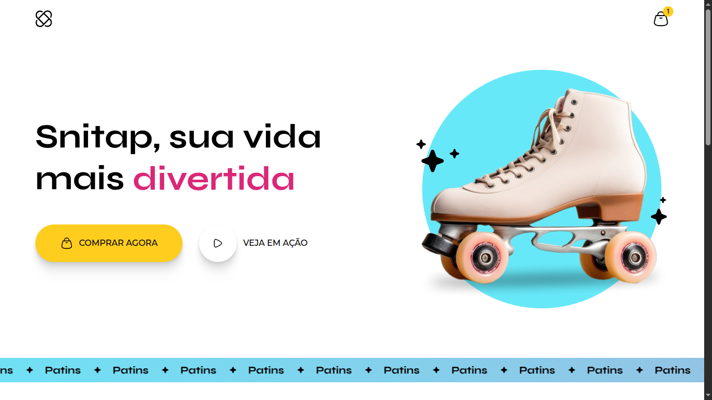

<p align="center">
  
</p>

# 🛼 Snitap

Este projeto é uma landing page moderna e vibrante desenvolvida para consolidar conhecimentos em **CSS avançado**, com foco especial em **animações**, interatividade e organização de código através de múltiplos arquivos de estilo.

## 🎯 Objetivos de Aprendizado

O foco principal deste projeto foi dominar as capacidades de animação nativas do CSS3, incluindo:

* **Keyframes e Timings:** Criação de movimentos complexos e fluidos.
* **Infinite Scrolling:** Implementação da faixa de texto infinito (ticker) na base do site.
* **Pseudo-classes e Transitions:** Micro-interações em botões e links para melhor UX.
* **Modularização de CSS:** Organização da folha de estilos em arquivos separados para facilitar a manutenção.

## 🛠️ Tecnologias

* **HTML5** (Semântica)
* **CSS3** (Flexbox, Grid e Animations)

## 📂 Estrutura de Arquivos

Conforme a arquitetura do projeto, os estilos foram divididos para manter a escalabilidade:

```text
├── assets/          # Imagens e ícones
├── styles/          # Folhas de estilo modulares
│   ├── banner.css   # Animação do ticker infinito
│   ├── global.css   # Variáveis, fontes e resets
│   ├── header.css   # Estilo do menu e logo
│   ├── hero.css     # Seção principal e animação do patins
│   └── ...          # Demais componentes
└── index.html       # Estrutura principal
